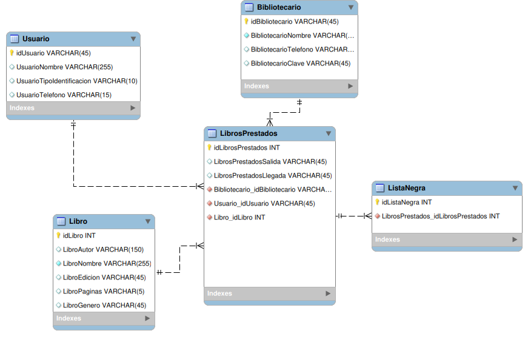
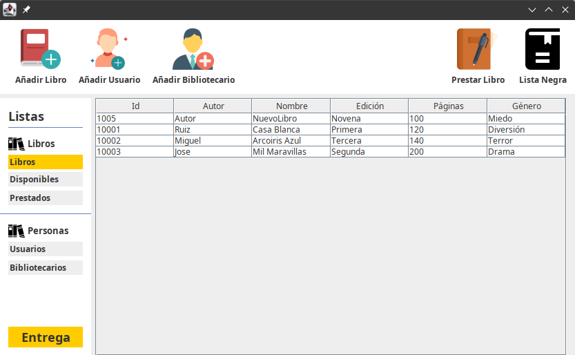
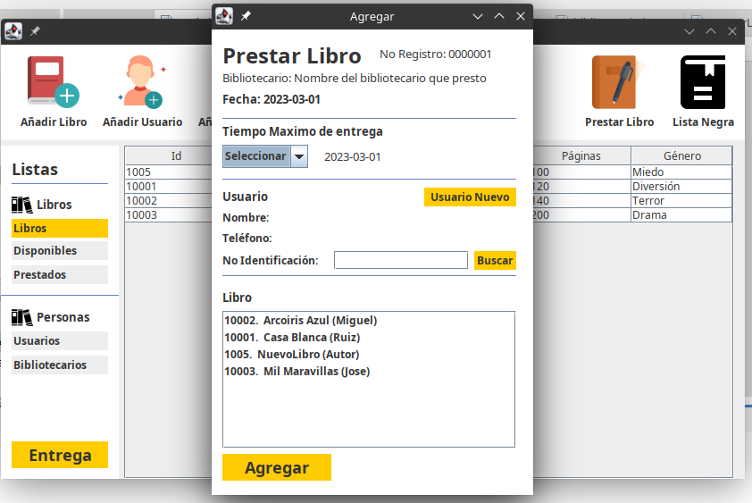
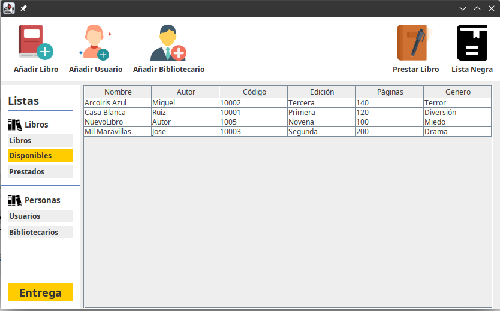

# Bibook 📙
Este programa fue hecho con el objetivo de solucionar el siguiente ejercicio:

      Problema 😵
      
      Se requiere una base de datos para gestionar el préstamo de libros en una biblioteca
      1. Se debe registrar cada bibliotecario en una lista
      2. Se debe registrar cada usuario de la biblioteca con mínimo nombre, identificación,
      teléfono, tipo de documento.
      3. Se deben registrar los libros disponibles en la biblioteca
      4. Se debe llevar un listado de los libros prestados

      Consideraciones
      1. Los libros prestados deben relacionar el usuario que pidió, el bibliotecario que lo
      prestó, el libro, la fecha de salida y fecha de entrega
      2. Debe existir una “lista negra” con los usuarios que no han entregado a tiempo el libro

## Modulos del programa 👷
Estas son las partes en las que se divide el programa y que funcionalidades tiene.
### Inicio: 
Aqui puede ingresar el bibliotecario con su numero de identificación y clave.

### Body: 
Todo el sistema, donde se puede realizar
- Busqueda de libro(Autor, paginas, nombre, codigo),
- Prestar libro,
- Agregar libro,
- Modificar usuarios,
- Ayuda, donde se muestra información del programador
- Lista negra,
- Libros Prestados,
- Libros Disponibles,
- Ver los Bibliotecarios(Pero contiene una clave de seguridad),

### OperacionesDB:
Esta carpeta sirve de soporte para el funcionamiento completo de Body, es la encargada de conectarce a la base de datos y realizar las consultas.

## Tecnologías utilizadas 🙊

## Procedimientos 👾
Primero se generan las tablas en MySQL Workbench, teniendo en cuenta las reglas normalización(1FN,2FN,3FN).

Una vez se tiene bien estructuradas las tablas, se genera el codigo y se integra en el administrador de bases de datos utilizado, en este caso __DBeaver__, y se comienza a generar los procedimientos, con el fin de dejar todo listo para que en la aplicación de Java, las consultas sean más cortas y sencillas de entender.

## Capturas

