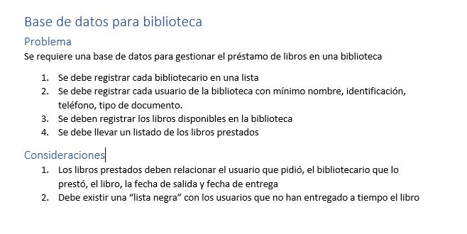

# Bibook 📙
Este programa fue hecho con el objetivo de solucionar el ejercicio propuesto en la siguiente imagen:

## Modulos del programa
Estas son las partes en las que se divide el programa y que funcionalidades tiene.
### Inicio: 
Aqui puede ingresar el bibliotecario con su numero de identificación y clave.

### Body: 
Todo el sistema, donde se puede realizar
- Busqueda de libro(Autor, paginas, nombre, codigo),
- Prestar libro,
- Agregar libro,
- Modificar usuarios,
- Ayuda, donde se muestra información del programador
- Lista negra,
- Libros Prestados,
- Libros Disponibles,
- Ver los Bibliotecarios(Pero contiene una clave de seguridad),

### OperacionesDB:
Esta carpeta sirve de soporte para el funcionamiento completo de Body, es la encargada de conectarce a la base de datos y realizar las consultas.

## Procedimientos

Primero se generan las tablas en MySQL Workbench, teniendo en cuenta las reglas normalización(1FN,2FN,3FN).
Una vez se tiene bien estructuradas las tablas, se genera el codigo y se integra en el administrador de bases de datos utilizado, en este caso __DBeaver__, y se comienza a generar los procedimientos, con el fin de dejar todo listo para que en la aplicación de Java, las consultas sean más cortas y sencillas de entender.
